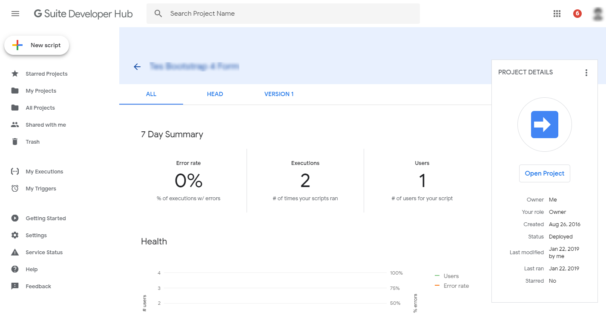

Pertama, buka [Google Apps Script](https://script.google.com/home/all) untuk menggunakan script ini.
-----

## Salin

1. Fork Repository ini dengan klik tombol <a class="btn btn-sm btn-with-count tooltipped tooltipped-s" aria-label="You must be signed in to fork a repository" rel="nofollow" data-hydro-click="{&quot;event_type&quot;:&quot;authentication.click&quot;,&quot;payload&quot;:{&quot;location_in_page&quot;:&quot;repo details fork button&quot;,&quot;repository_id&quot;:55763300,&quot;auth_type&quot;:&quot;LOG_IN&quot;,&quot;client_id&quot;:null,&quot;originating_request_id&quot;:&quot;A91A:65AE:23F0BC:332F06:5CB05B2D&quot;,&quot;originating_url&quot;:&quot;https://github.com/mcseptian/hello&quot;,&quot;referrer&quot;:null,&quot;user_id&quot;:null}}" data-hydro-click-hmac="b1ec400f320c02cbb2bad451c45169b8c70a9045f45a29372a7bfde4c8bbe8bd" href="/login?return_to=%2Fmcseptian%2Fhello"><svg class="octicon octicon-repo-forked v-align-text-bottom" viewBox="0 0 10 16" version="1.1" width="10" height="16" aria-hidden="true"><path fill-rule="evenodd" d="M8 1a1.993 1.993 0 0 0-1 3.72V6L5 8 3 6V4.72A1.993 1.993 0 0 0 2 1a1.993 1.993 0 0 0-1 3.72V6.5l3 3v1.78A1.993 1.993 0 0 0 5 15a1.993 1.993 0 0 0 1-3.72V9.5l3-3V4.72A1.993 1.993 0 0 0 8 1zM2 4.2C1.34 4.2.8 3.65.8 3c0-.65.55-1.2 1.2-1.2.65 0 1.2.55 1.2 1.2 0 .65-.55 1.2-1.2 1.2zm3 10c-.66 0-1.2-.55-1.2-1.2 0-.65.55-1.2 1.2-1.2.65 0 1.2.55 1.2 1.2 0 .65-.55 1.2-1.2 1.2zm3-10c-.66 0-1.2-.55-1.2-1.2 0-.65.55-1.2 1.2-1.2.65 0 1.2.55 1.2 1.2 0 .65-.55 1.2-1.2 1.2z"></path></svg>Fork</a> atau klik [link ini](https://github.com/login?return_to=%2Fmcseptian%2Fhello).
2. Install ekstensi (https://chrome.google.com/webstore/detail/google-apps-script-github/lfjcgcmkmjjlieihflfhjopckgpelofo) di Browser [Chrome](https://www.google.com/intl/en/chrome/browser/desktop/index.html?standalone=1) kamu lalu login dengan akun [github](https://github.com/) melalui ekstensi.
3. Buat Project baru dengan membuka [Google Apps Script](https://script.google.com/home/all) lalu pilih repository dan pilih branch yang telah kamu fork.

## Pembukaan

Pembukaan Project [Google Apps Script](https://script.google.com/home/all) dilakukan dengan klik tombol Open Project. 

Setelah terbuka pada *menubar* akan tampil beberapa pilihan untuk Development. Salah satunya adalah menu Publish yang salah satunya berfungsi untuk menerbitkan kode yang kita buat menjadi aplikasi web atau *Deploy as web app…*. Berikut ini langkah demi langkah untuk menggunakan fungsi tersebut:

### Pertama

Setelah klik kita akan ditampilkan menu dengan berbagai pilihan, ubah nilai *Who has access to the app:* menjadi *Anyone, even anonymous* dan klik tombol Update.

### Kedua

Klik tombol *Review Permission*.

### Ketiga

Pilih akun yang akan digunakan untuk *Publish*.

### Keempat

Klik link *Advanced*.

### Kelima

Klik link *Go to* meskipun itu *(unsafe)*.

### Keenam

Lalu klik tombol *Allow*.

### Ketujuh

Kalian bisa akses melalui *Current Web App URL*.
